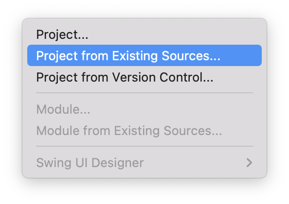
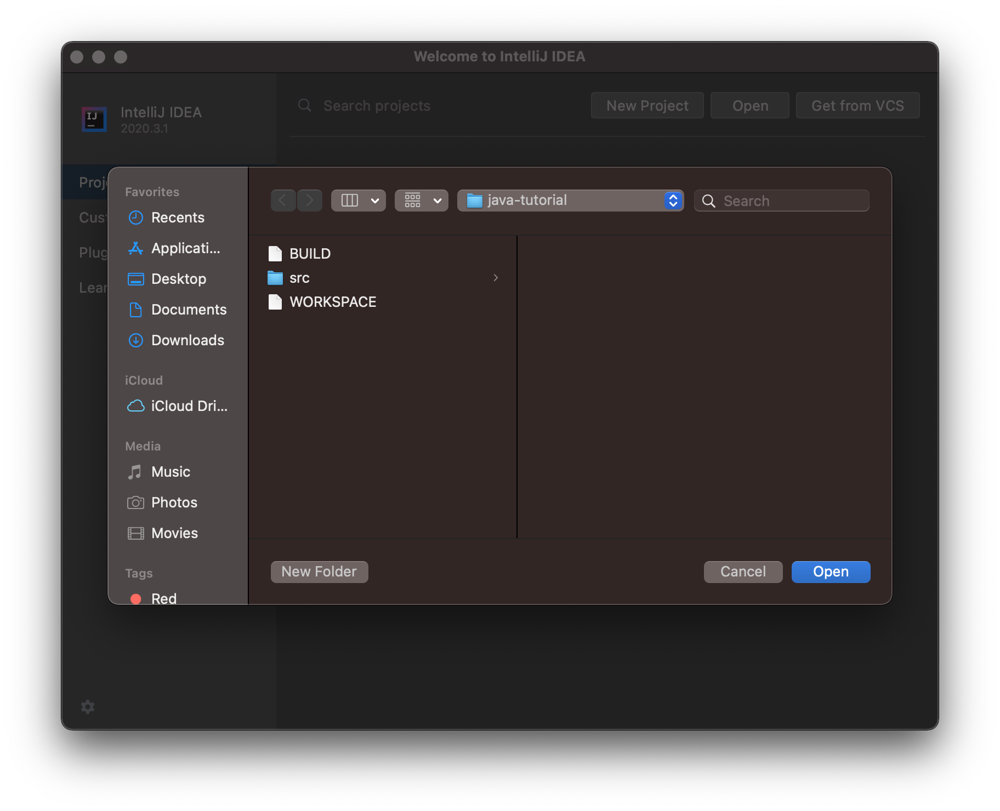
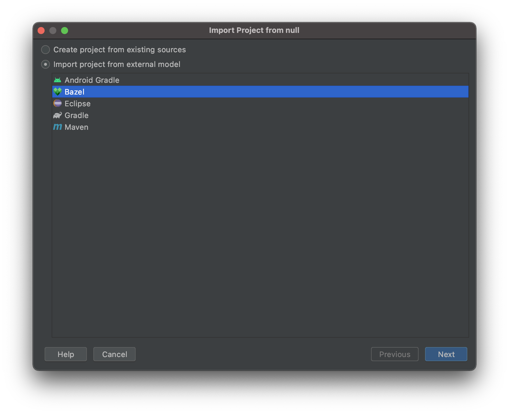
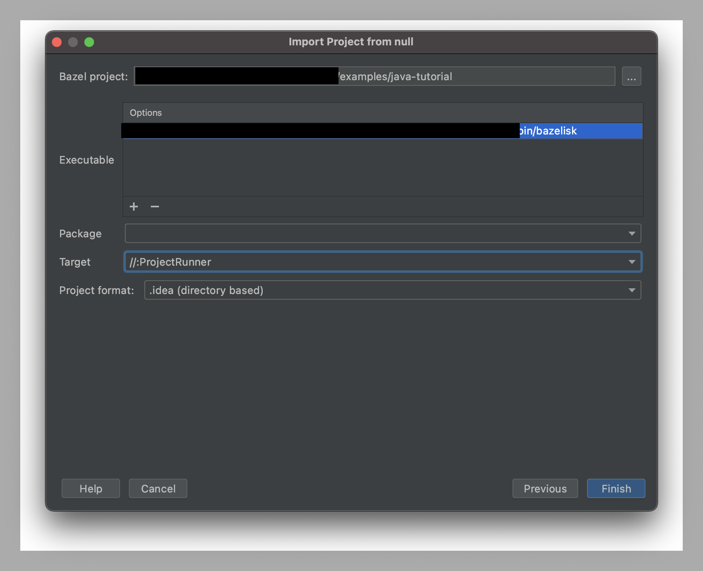
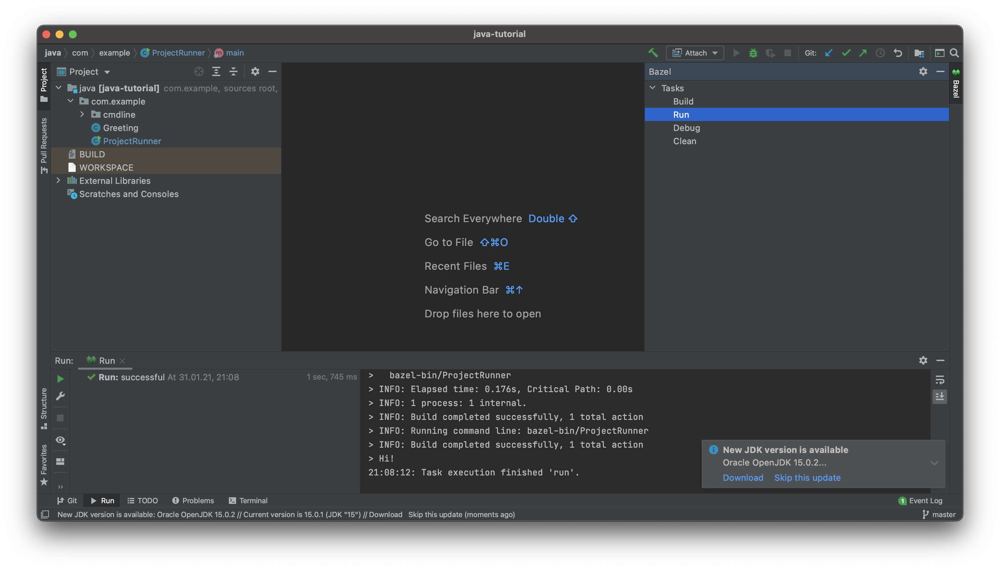
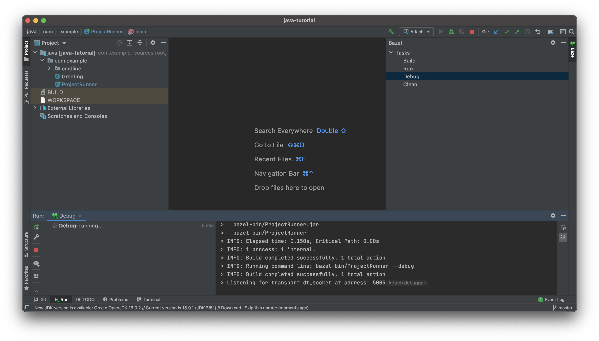
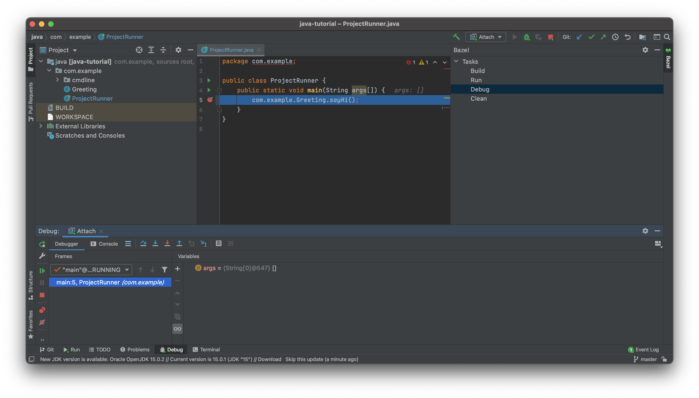

# Bazel plugin for Intellij IDEA

Intellij IDEA is an incredible tool for creative and efficient coding.
it supports a huge list of external tools that make this IDE even more
fun to work with.

At some point, I was curious about how easy it would be to integrate another
external tool. At the same time, I happened to start working with [Bazel](https://bazel.build/)
build system that is not officially supported by IDEA. Thus, I have decided to
try to integrate it and get familiar with the internals of the tool I like.

Currently, it supports "import from existing sources" action.

**_TODO_**: Add support/Include into project bazel build files.

## HOWTO

### Install plugin

1. Get the plugin. There are several ways of doing it:
    - Build from sources by executing: `./gradlew assemble`.
    - Download from [Marketplace](https://plugins.jetbrains.com/plugin/15874-ideabazel).
2. `Install plugin from Disk`.

### Use plugin

1. `New` | `Project from Existing Sources...`.
   
2. Navigate to the project to import and click `OK`.
   
3. Select `Bazel` from the list of available project types.
   
4. Fill in the form with correct data: path to bazel executable/package/target.
   
5. Run Bazel task from the list of tasks presented by tthe Bazel toolwindow.
   
6. To start a debugging session run `Debug` task and attach a debugger to it.
   
   
